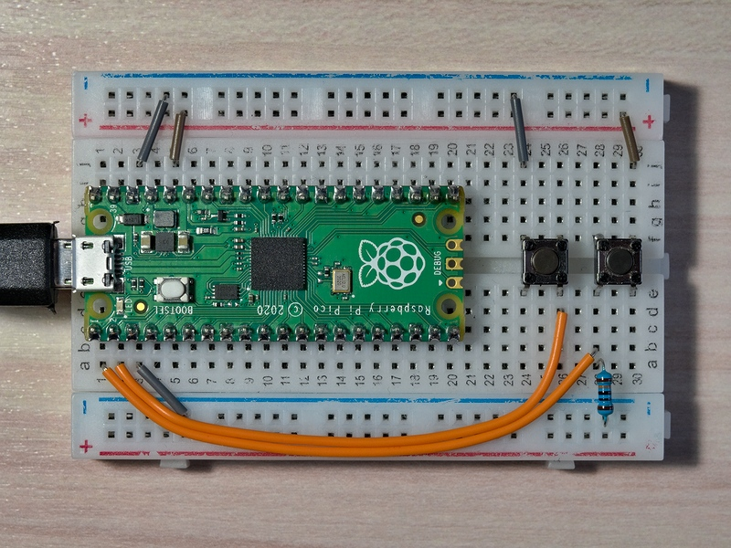

# MicroPython SimpleButton

A simple MicroPython class for handling button presses using GPIO interrupts.
It includes debouncing and press/release callbacks.

## Features

* **Interrupts:**
Uses pin interrupts (`IRQ_FALLING`, `IRQ_RISING`)
for non-blocking button detection.
* **Debouncing:**
Implements time-based debouncing during button transitions.
* **Callbacks:**
Allows assigning functions to be called automatically
on button press and release events.
* **Configurable:**
  * Supports internal **pull-up/pull-down** resistors
    (`Pin.PULL_UP`, `Pin.PULL_DOWN`) or **external resistors** (`pull=None`).
  * Supports **active-low** (LOW signal = pressed) and **active-high**
    (HIGH signal = pressed) logic via the `active_low` parameter.
* **State Checking:**
`is_pressed()` and `is_released()` provide the current debounced state.
* **Cleanup:**
Includes a `deinit()` method to disable interrupts.

## Installation

Copy the `simple_button.py` file to the root directory
or the `/lib` directory on your MicroPython device's filesystem.
You can use tools like [`pyboard.py`][1] or [Thonny IDE's][2] file manager.

## Usage

```Python
import sys
from utime import sleep_ms
from machine import Pin
from simple_button import SimpleButton


def button_handler(message: str) -> None:
    sys.stdout.write(f"{message} \n")


def echo() -> None:
    sys.stdout.write("Button pressed \n")


def main() -> None:
    # Setup with an external pull-down resistor (connect button to VCC/3V3)
    button_0 = SimpleButton(
        0,
        press_callback=lambda i=0: button_handler(f"Button {i} pressed"),
        release_callback=lambda i=0: button_handler(f"Button {i} released"),
        pull=None,         # Disable internal pull
        active_low=False   # Active-high logic
    )

    # Setup with internal pull-up resistor (connect button to GND)
    button_1 = SimpleButton(
        1,
        press_callback=lambda i=1: button_handler(f"Button {i} pressed"),
        release_callback=lambda i=1: button_handler(f"Button {i} released"),
        pull=Pin.PULL_UP,
        active_low=True
    )

    gpio: list[int] = list(range(2, 10))
    buttons: list[SimpleButton] = []

    # Multiple buttons in a loop
    for gpio_pin in gpio:
        buttons.append(SimpleButton(gpio_pin, press_callback=echo))

    while True:
        # Do other things or just sleep
        sleep_ms(500)


if __name__ == "__main__":
    main()

```

### Raspberry Pi Pico Button Wiring Demo



[1]: https://docs.micropython.org/en/latest/reference/pyboard.py.html
[2]: https://thonny.org
